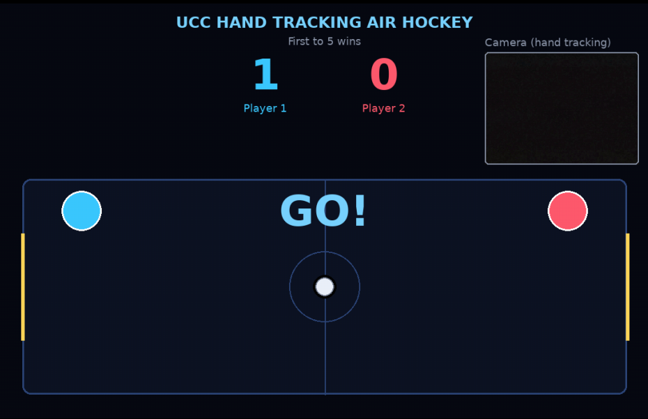

# UCC Hand Tracking Air Hockey — Python Edition

<p align="center">
  
  <br>
  Umaha Coders Community
</p>

Game Air Hockey yang dimainkan menggunakan Webcam dan dibuat menggunakan Python

> Project EXPO UKM UCC (Umaha Coders Community) 2026 oleh [Achmad Danny Kurniawan](https://github.com/dnnykur) dan [Ahmad Surya Rifandi](https://github.com/Adsani) 

## Preview
<p align="center">
  
</p>

## Cara main:
- 2 pemain berdiri di depan 1 webcam.
- Tangan di sisi KIRI frame kamera -> mengontrol paddle Player 1 (kiri).
- Tangan di sisi KANAN frame kamera -> mengontrol paddle Player 2 (kanan).
- Gerakkan telapak tangan naik/turun/kiri/kanan untuk menggerakkan paddle.
- Pantulkan bola ke gawang lawan. Peraih 5 gol pertama akan dinyatakan menang.

## Cara Install
### Linux
Menggunakan [uv](https://github.com/astral-sh/uv) (Direkomendasikan):
```
git clone https://github.com/dnnykur/hand-tracking-air-hockey-ucc-expo.git AirHockey
cd AirHockey
uv sync
uv run AirHockey
```
Menggunakan venv dan pip (Python harus terinstall terlebih dahulu):
```
git clone https://github.com/dnnykur/hand-tracking-air-hockey-ucc-expo.git AirHockey
cd AirHockey
python -m venv .venv
source .venv/bin/activate
pip install -r requirements.txt
python src/main.py
```

### Windows
Menggunakan [uv](https://github.com/astral-sh/uv) (Direkomendasikan):
```
git clone https://github.com/dnnykur/hand-tracking-air-hockey-ucc-expo.git AirHockey
cd AirHockey
uv sync
uv run AirHockey
```
Menggunakan venv dan pip (Python harus terinstall terlebih dahulu):
```
git clone https://github.com/dnnykur/hand-tracking-air-hockey-ucc-expo.git AirHockey
cd AirHockey
python -m venv .venv
.venv\Scripts\activate
python -m pip install -r requirements.txt
python src/main.py
```

## Cara Melihat Camera Index
Jika webcam tidak terdeteksi atau ingin menggunakan kamera lain, cek index kamera lalu ubah nilai `CAM_INDEX` di `src/config.py`.

### Linux
Lihat daftar device kamera:
```bash
ls /dev/video*
```

Jika perintah `v4l2-ctl` tersedia, lihat nama kamera dan device-nya:
```bash
v4l2-ctl --list-devices
```

Biasanya `/dev/video0` berarti index `0`, `/dev/video1` berarti index `1`, dan seterusnya. Untuk menguji index yang bisa dibuka OpenCV:
```bash
python -c "import cv2; [(print(f'Camera index {i}: tersedia'), cap.release()) for i in range(10) if (cap := cv2.VideoCapture(i)).isOpened()]"
```

### Windows
Buka PowerShell di folder project, lalu jalankan:
```powershell
python -c "import cv2; [(print(f'Camera index {i}: tersedia'), cap.release()) for i in range(10) if (cap := cv2.VideoCapture(i)).isOpened()]"
```

Index yang menampilkan `tersedia` dapat dicoba di game. Windows tidak menggunakan nama `/dev/videoN`; camera index ditentukan oleh OpenCV, sehingga urutannya bisa berbeda setelah kamera USB ditambah atau dilepas.

Ubah index di `src/config.py`, misalnya:
```python
CAM_INDEX = 1
```
